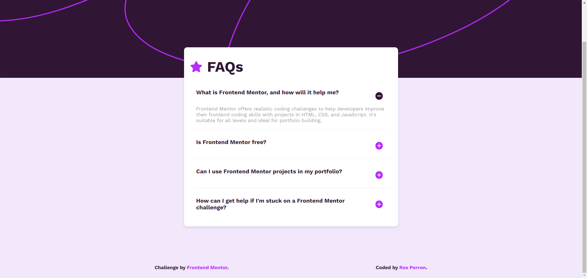

# Frontend Mentor - FAQ accordion solution

This is my solution to the [FAQ accordion challenge on Frontend Mentor](https://www.frontendmentor.io/challenges/faq-accordion-wyfFdeBwBz). 

Frontend Mentor challenges help me to improve your coding skills by building realistic projects. 

## Table of contents

  - [The challenge](#the-challenge)
  - [Screenshot](#screenshot)
  - [Links](#links)
  - [Built with](#built-with)
  - [What I learned](#what-i-learned)
  - [Useful resources](#useful-resources)
  - [Author](#author)

### The challenge

Users should be able to:

- Hide/Show the answer to a question when the question is clicked
- Navigate the questions and hide/show answers using keyboard navigation alone
- View the optimal layout for the interface depending on desktop screen only
- See hover and active state for all interactive elements on the page

### Screenshot

### Links

- Live Site URL: [FAQ Accordion Vanilla JS](https://roxperron.github.io/fm-faq-accordion/)

### Built with

- HTML5
- CSS3 
- Vanilla JavaScript

### What I learned

This is the first time I’ve coded something new since finishing my academic program, so this project has been a real exercise in memory and revision. I encountered a CSS bug related to a selector rule, which helped me better understand the effects of cascading in stylesheets.

While working on the JavaScript, I had difficulties with using `querySelector` vs `querySelectorAll`. However, by doing some research, I found an article on freeCodeCamp that helped me debug my code.

This project also allowed me to review the principles of semantic HTML and CSS properties. I tried to apply the BEM naming convention for my classes to make my code more structured and maintainable.

### Useful resources

- [Accordion menu by freeCodeCamp](https://www.freecodecamp.org/news/build-an-accordion-menu-using-html-css-and-javascript/) 

This helped me better understand how `querySelectorAll` works and also assisted me in refactoring my CSS to be more accurate.

### Continued development

Use this section to outline areas that you want to continue focusing on in future projects. These could be concepts you're still not completely comfortable with or techniques you found useful that you want to refine and perfect.

## Author

- Frontend Mentor - [@roxperron](https://www.frontendmentor.io/profile/roxperron)

